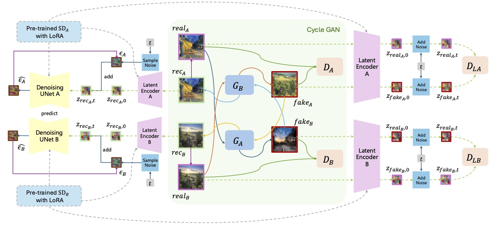

# Latent-CycleGAN



This repository contains the code for our **Computer Vision 2024/25 WS** final project, **Latent-CycleGAN**, which integrates a pretrained Stable Diffusion model (optionally fine-tuned via LoRA) into the CycleGAN framework for unpaired image-to-image translation.

- The **core** Latent-CycleGAN code is located in:  
  `./models/latent_cycle_gan_model.py`

---

## Prerequisites

- Linux or macOS
- Python 3.8 (or higher)
- NVIDIA GPU + CUDA + cuDNN

---

## Getting Started

### 1. Installation

1. **Clone this repo**:
   ```bash
   git clone https://github.com/HeyuanChi/latent-cycle-gan
   cd latent-cycle-gan
   ```

2. **Set up the environment**:
   - If you have an `environment.yml` (or `requirements.txt`):
     ```bash
     conda env create -f environment.yml
     conda activate latent-cycle-gan
     ```
     Adjust these steps as needed based on your Python environment.

---

### 2. Prepare Stable Diffusion v1.5 and LoRA Checkpoints

Latent-CycleGAN relies on **Stable Diffusion v1.5** plus optional LoRA checkpoints for domain adaptation:

1. **Stable Diffusion v1.5**  
   - Download from a recognized source (e.g., Hugging Face) and place the model weights where your code can access them.  
   - Check that your training and testing scripts point to the correct SD v1.5 paths.

2. **LoRA Checkpoints**  
   - Prepare LoRA checkpoints for domain A (`--lora_A_dir`) and domain B (`--lora_B_dir`), each tuned for SD v1.5.  
   - If you do not plan on using LoRA, either disable these arguments or point them to dummy folders. Note that the latent-cycle-gan model is designed to benefit from LoRA fine-tuning.

---

### 3. Dataset Preparation

Follow the [CycleGAN/Pix2Pix dataset format](https://github.com/junyanz/pytorch-CycleGAN-and-pix2pix).  
For example, `vangogh2photo` might look like:

```
datasets/vangogh2photo/
├── trainA/
├── trainB/
├── testA/
└── testB/
```

- `trainA` contains images from domain A (e.g., Van Gogh paintings),
- `trainB` contains images from domain B (e.g., real photos),
- `testA` and `testB` are for testing.

If needed, you can download a sample CycleGAN dataset (e.g. `vangogh2photo`) with:
```bash
bash ./datasets/download_cyclegan_dataset.sh vangogh2photo
```

---

### 4. Training: `train.sh` Example

We provide a shell script `train.sh` for convenience. Below is an example:

```bash
#!/usr/bin/env bash

TRAIN_SCRIPT="./train.py"

DATAROOT="./datasets/example"
NAME="latent-example-new"
LORA_A_DIR="./lora/exampleA"
LORA_B_DIR="./lora/exampleB"
CYCLE_GAN_DIR="./checkpoints/example/"

N_EPOCHS=40
N_EPOCHS_DELAY=10

LAMBDA_A=10
LAMBDA_B=10
LAMBDA_IDENTITY=10
LAMBDA_GAN=1

ALPHA_GAN=0
ALPHA_A=0.1
ALPHA_B=0.1

LR=0.0001

python $TRAIN_SCRIPT \
    --dataroot $DATAROOT \
    --name $NAME \
    --model latent_cycle_gan \
    --lora_A_dir $LORA_A_DIR \
    --lora_B_dir $LORA_B_DIR \
    --batch_size 16 \
    --init_with_cycle_gan True \
    --cycle_gan_dir $CYCLE_GAN_DIR \
    --n_epochs $N_EPOCHS \
    --n_epochs_decay $N_EPOCHS_DELAY \
    --lambda_A $LAMBDA_A \
    --lambda_B $LAMBDA_B \
    --lambda_identity $LAMBDA_IDENTITY \
    --lambda_gan $LAMBDA_GAN \
    --alpha_gan $ALPHA_GAN \
    --alpha_A $ALPHA_A \
    --alpha_B $ALPHA_B \
    --lr $LR
```

Run:
```bash
bash train.sh
```

This will start the training process with the specified settings.

#### Key Arguments Explanation

- **`--dataroot $DATAROOT`**  
  Path to your **unpaired** training dataset (e.g., `./datasets/example`).  
  Must follow the CycleGAN directory structure:
  ```
  trainA/
  trainB/
  testA/
  testB/
  ```
- **`--name $NAME`**  
  Name for this training run. Checkpoints/logs go in `./checkpoints/<name>`.
- **`--lora_A_dir`, `--lora_B_dir`**  
  Paths to LoRA checkpoints (fine-tuned for domain A and B).  
  If unused, provide dummy paths or skip them if your code allows.
- **`--init_with_cycle_gan True`**  
  Use a pretrained CycleGAN model from `--cycle_gan_dir` to initialize weights.
- **`--lambda_A`, `--lambda_B`**  
  Cycle-consistency loss weights for the A→B→A and B→A→B directions.
- **`--lambda_identity`**  
  Weight for the identity loss, preserving low-level features when input is already in the target domain.
- **`--lambda_gan`**  
  Weight for the standard image-space adversarial loss.
- **`--alpha_gan`**  
  Weight for the **latent-space** adversarial loss. If 0, latent adversarial is disabled.
- **`--alpha_A`, `--alpha_B`**  
  Weights for latent cycle-consistency. Enforces reconstruction consistency in the Stable Diffusion latent space.
- **`--lr`**  
  Initial learning rate (often `0.0001`).

---

```markdown
### 5. Testing

After training finishes, you can directly run the provided test script:

```bash
#!/usr/bin/env bash

TEST_SCRIPT="./test.py"

python $TEST_SCRIPT \
    --dataroot ./datasets/example \
    --name latent-example \
    --model latent_cycle_gan \
    --num_test 10
```

This command will run inference on (up to) `--num_test` images from your test set, saving the translated results to the default output directory (usually `./results/<name>/test_latest/images/`). If you need to test on the entire set or adjust any other parameters (e.g., batch size, model name), you can modify them directly in the script or pass different flags via the command line.
---

### 6. Checkpoints & Logs

- Checkpoints and logs are stored under `./checkpoints/<name>/`.  
- You should find model weights (like `latest_net_G_A.pth`) and any generated samples or loss logs there.

---

### 7. Common Issues

1. **Out of Memory (OOM)**  
   - Lower `--batch_size` or reduce image resolution.

2. **Stable Diffusion Weights Not Found**  
   - Confirm your code can locate the SD v1.5 checkpoint and LoRA files.  
   - If you see errors about missing or mismatched UNet weights, make sure versions match.

3. **LoRA Compatibility**  
   - LoRA checkpoints must be trained for the same SD v1.5 version.  
   - A mismatch can cause artifacts or script errors.

---

### 8. Acknowledgments

- Code builds upon [CycleGAN](https://github.com/junyanz/pytorch-CycleGAN-and-pix2pix).  
- LoRA method references [LoRA: Low-Rank Adaptation of Large Language Models](https://arxiv.org/abs/2106.09685).

---

## License

This project is released under the [MIT License](./LICENSE) (or specify whichever license applies).

---

If you have any questions or encounter issues, feel free to open an issue or reach out to the contributors. Good luck with your experiments!
```